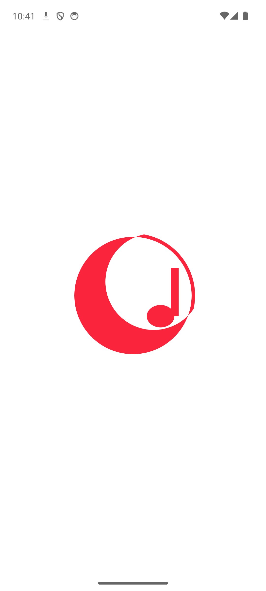
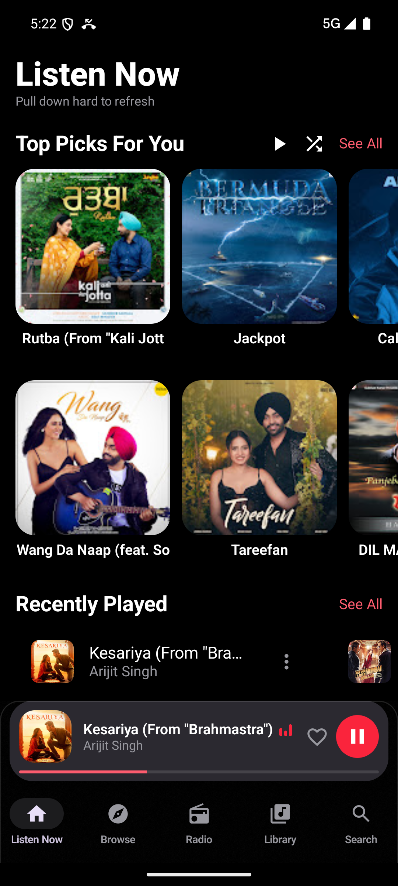
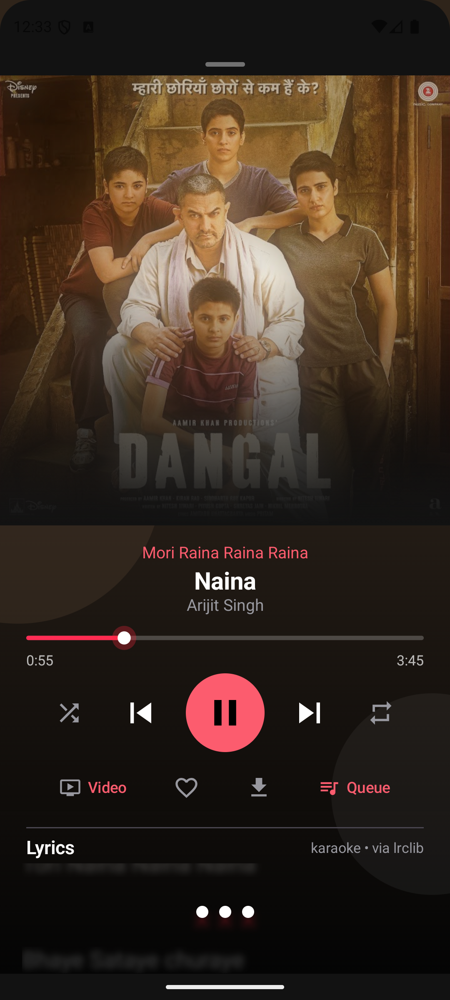
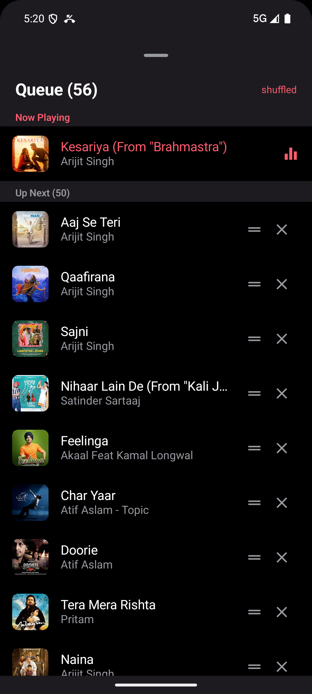
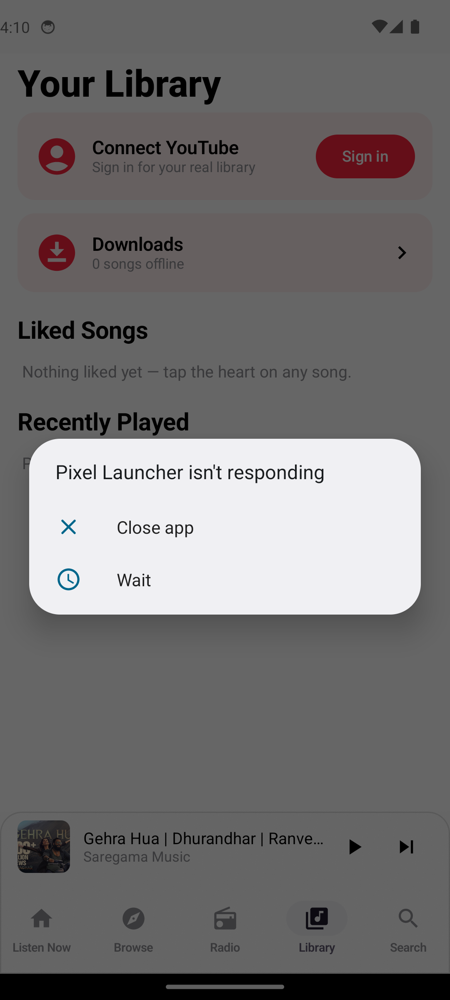

# Cresca Music


Cresca Music is an Android music player with an Apple Music style interface,
powered by live YouTube data. Search millions of songs, stream instantly,
watch music videos, follow synced karaoke lyrics, build playlists, download
for offline, and sign in with your YouTube session. Everything stays on
your device — no account, no analytics, no server.

## Download

Get the APK from [**Releases**](https://github.com/ritz0007/Cresca/releases)
(`Cresca-Music-vX.Y.Z.apk`). Copy it to your phone, tap it, allow
"Install unknown apps". Requires Android 8.0+.

## Screenshots

| Splash | Home |
|---|---|
|  |  |

| Player + karaoke lyrics | Up Next queue |
|---|---|
|  |  |

| Library |
|---|
|  |

## Features

- **Listen Now home** — live song rails, New Releases, Moods, instant cache loads
- **Real YouTube audio** — search + signature-deciphered streams, Media3 playback
- **Full player** — blurred artwork + dominant-color lava wash, karaoke
  ticker above the title, sleek glowing seek bar, credits card, shuffle,
  repeat (off/all/one), queue, seek, like, video toggle
- **Up Next queue** — shuffle-aware order, gapless auto-advance, tap-to-play
- **Music videos** — embedded player driven by the music transport, expand +
  quality (1080p DASH adaptive, muxed fallback)
- **Karaoke lyrics** — fuzzy multi-source search, synced highlighting +
  auto-scroll
- **Playlists** — create, add, remove, Spotify-style screen, smart suggestions
- **Downloads** — "Artist - Title" files, in-app or device Music folder,
  offline library, offline-first playback
- **Library** — profile page (account, light/dark/system theme, downloads,
  clear cache), update checker banner, liked, recents
- **YouTube login** — in-app sign-in, encrypted on-device session
- **System integration** — media notification with artwork/controls, lockscreen
  controls, Android 16+ Live Updates chip with live progress
- **Apple look** — light/dark theme, Cresca red, liquid-glass bottom bars,
  animated splash + intro
- **Songs only** — compilations, mixes and hour-long uploads are filtered out

More detail: [docs/FEATURES.md](docs/FEATURES.md).

## Build from source

Requirements: JDK 17, Android SDK (platform + build-tools 35/36),
Gradle 8.9. Point `local.properties` at your SDK:

```properties
sdk.dir=C\:\\Users\\YOU\\AppData\\Local\\Android\\Sdk
```

```powershell
$env:JAVA_HOME = "C:\Program Files\Microsoft\jdk-17.0.20.101-hotspot"
$env:ANDROID_HOME = "$env:LOCALAPPDATA\Android\Sdk"
C:\Gradle\gradle-8.9\bin\gradle.bat assembleDebug --console=plain
```

APK: `app/build/outputs/apk/debug/app-debug.apk`

## Project structure

```
app/src/main/java/com/cresca/app/
  MainActivity.kt        all screens, mini-player, glass bars, full player, intro
  YoutubeRepository.kt   search + audio/video resolving + caches + 403 fallback
  PlayerQueue.kt         queue, shuffle, repeat, prefetch
  PlaybackService.kt     background playback + media session
  LiveUpdateProvider.kt  Android 16+ Live Updates notification + progress ticker
  LyricsRepository.kt    lrclib + lyrics.ovh + LRC parser
  LyricsFlow.kt          karaoke visualizer view
  VideoSheet.kt          embedded + fullscreen video surfaces (session-driven)
  SessionSheet.kt        YouTube sign-in sheet
  YtSessionManager.kt    encrypted session store
  DownloadStore.kt       offline engine (DownloadManager)
  PlaylistStore.kt       user playlists store
  SongCache.kt           home/search disk cache
  LikedStore.kt          liked songs store
  UpdateCheck.kt         daily GitHub release poll + update banner
  ui/theme/              palette, type, theme
```

## Privacy

Login cookies live in EncryptedSharedPreferences on the device. Clearing app
data wipes everything. Release download counts are public on GitHub; the app
itself reports nothing anywhere.

## Changelog

See [CHANGELOG.md](CHANGELOG.md).
